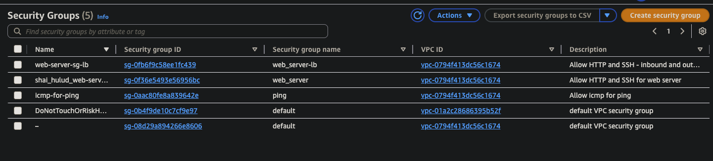
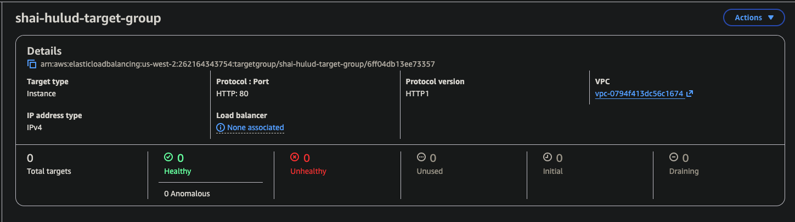
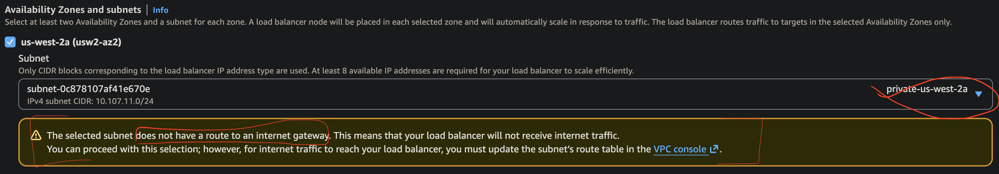
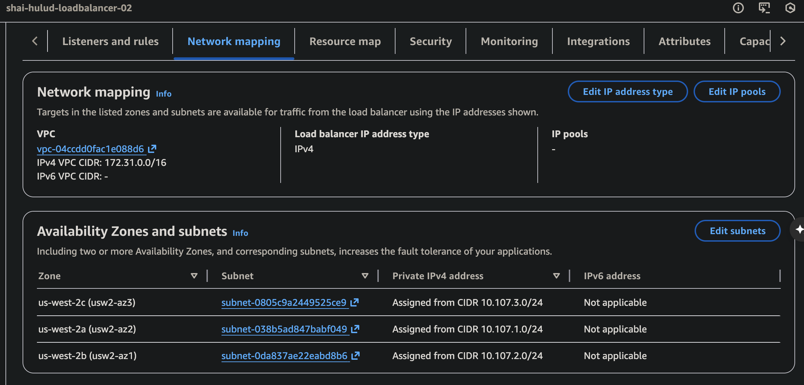
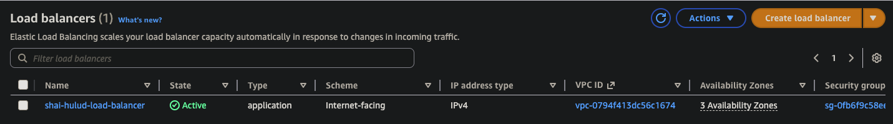

NOW, we build in terraform:
https://docs.aws.amazon.com/autoscaling/ec2/userguide/tutorial-ec2-auto-scaling-load-balancer.html

## SG for LB
- copy existing working sg: 6-sg.tf
- made new file - 6-sg-lb copy/paste
- highlighted name ("web_server"), right-click, Change All Occurrences, right arrow the cursor, added -lb ("web_server-lb")
- LB works on port 80
	- check ingress rule on vpc security group
	- commented out ssh ingress rule on port 22 = don't need for a LB
		- ingress (inbound) rule = HTTP
		- egress (outbound) rule = "0.0.0.0/0"
		- ip_protocol = "-1"
- second sg = DONE = WORKS!

## Launch Template

### ClickOps

Leverage Theo
https://github.com/malgus-waf/class5/blob/main/7-launchtemplate.tf
- copy/paste into new 8-launchtemplate.tf file

you have working EC2 so copy into for image_id
- make sure it matches the image_id and instance_type in your already known WORKING EC2
- confirm t3.micro instance_type
- copy/past security ids and user data file name

### Terraform - Launch Template

## Target Group

### Clickops - Target Group
- target type == instances
- protocol == http
- port == 80
- ip address type == ipv4
- make sure to select your custom VPC
- health checks, dont touch
- on "register targets" screen, DONT SELECT ANY EC2s if available. scroll down and click the orange button. KEY: The instances here that were made (manually or tf) = don't care. Don't want your tg to worry about these instances...want it to worry about the instances using the ASG. ONLY ONE TG is necessary.
- on the next page, look over the settings, review your notes, and if everything aligns, click the orange button!

## Terraform - Target Group

Leverage Theo
https://github.com/malgus-waf/class5/blob/main/8-TargetGroup.tf

Change app1 to shai-hulud-target-group

Copy your vpc_id from the 1-vpc file

## Load Balancer

### Clickops - Load Balancer
- choose application load balancer, per instructions of block captain larry...for Cert test, Network LB and Gateway LB need to known
- scheme == internet facing
- LB IP address type == ipv4
- network mapping == custom VPC, select ALL AZs, and select PUBLIC subnets for each AZ. Internet-facing scheme REQUIRES it. DO NOT MAKE THIS MISTAKE! Switch from private to public!

Public gateway needed = IGW...private goes to NAT gateway

- security group == delete default, and use the custom LB security group created previously
- listnener == http:80
- default action == forward to TGs
- target group == TG created today...can use multiple later. So, this is ONE listener...what the LB will detect for traffic. listening for traffic on port 80.
- review the summary, make sure that the subnets are pointed to public subnets, make sure the SG is going towards your load balancer SG, and that all 3 AZs are selected. once ready, click orange button!

Cool stuff to do later
- AWS CloudFront (speed)
- AWS Web Application Firewall (WAF) = security= layer 7 on OSI layer (Please Do Not Throw Sausage Pizza Away!!) = Application layer = The LOOT is here! 
	- **A web application firewall (WAF) protects the application layer and is specifically designed to analyze each HTTP/S request at the application layer**.
- AWS Global Accelerator (primarily gaming...super high-speed performance)

DNS Name for our LB:
shai-hulud-loadbalancer-02-654373030.us-west-2.elb.amazonaws.com
- this is how we access our EC2s behind our LB and ASG

### Terraform - Load Balancer

Leverage Theo
https://github.com/malgus-waf/class5/blob/main/9-LoadBalancer.tf

Go to 6-sg-lb file for the actual load balancer name...paste it into this security_groups

Go to 0-auth file for region and change it

We hava an lb, now we have to build a listener

Don't need acm certificate...edit, toggle line comment

Lot of pain & suffering here if there wasn't WORKING CODE...thank THEO!

## ASG

### ClickOps - ASG
- launch template == select custom launch template, specify desired version, then click orange button
- network == select custom VPC, and all PRIVATE subnets in your AZs, then click orange button
- integrate with other services == choose "attach to existing load balancer", and choose accurate target group
- health check == turn on ELB (elastic load balancing)_ health checks, and leave grace period as default, then click orange button
- configure group size & scaling == check scaling notes below for the numbers. 
- select target tracking policy and use the defaults. once finished, click the orange button.
- add notifications == will be used later. click orange button.
- tags == click orange button.
- review == confirm that above config is applied to your ASG, then PRAY TO YOUR GOD OF UNDERSTANDING, and click orange button!

Copy the DNS name from the Load Balancer and run it with refreshes:
shai-hulud-loadbalancer-02-654373030.us-west-2.elb.amazonaws.com
- make sure to put http:// in front of the url

You now have a WORKING load balancer!! Good job!
- load balancer = public
- ASG = private

### Terraform - ASG

asg == auto scaling group
- expands/contracts based on activity/capacity

Load balancer == public subnets
ASG == private subnets

scaling notes:
minimum desired capacity is usually 1 EC2 per AZ = 3
desired capacity is usually 2 EC2s per AZ = 6
Max desired capacity is usually 3 EC2s per AZ = 9

