Terraform pt. 7: S3 Hosted webpage

goal = create an S3 bucet and host a custom public webpage

deliverables = link of functional S-3 hosted webpage

S3 can do a lot
- Simple Storage Service
- hosting objects/images
- static webpage/html file

1. Create a bucket: ai-engineering-corpus
2. Upload desired files
3. Check a file for testing
	- check box
	- click Copy URL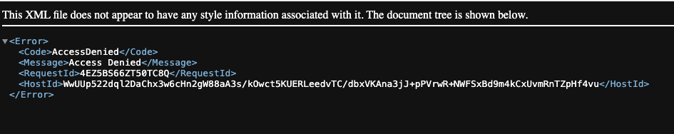
		- access denied due to bucket permissions
4. Go to Properties
	1. bottom...Static website hosting
	2. Edit
	3. Enable - site will be determined by the html file you point to = index.html (MUST SPECIFY THIS SPECIFIC NAME). 
		1. Can name it whatever you want but the object name has to equal the Index document name
 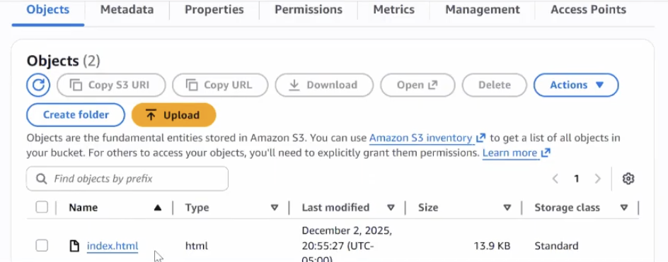

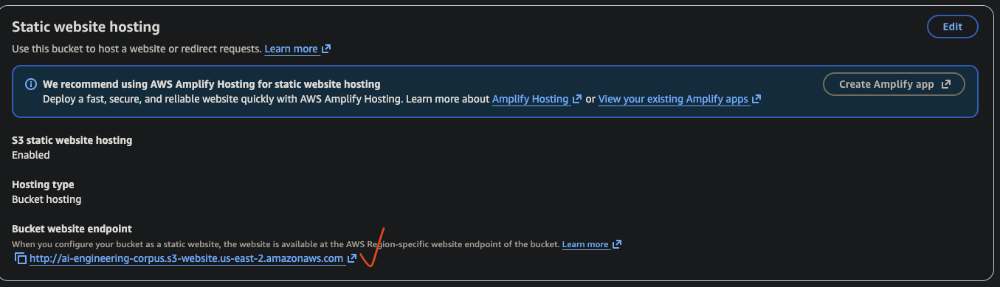

Go to Permissions tab

Turn OFF Block public access (bucket settings)...still error
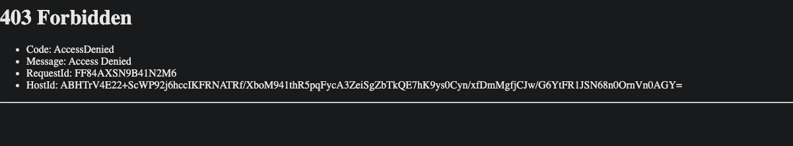
Now, modify the ACLs
- Permissions tab, Object Ownership
- bucket owner enforced
	- "ACLs are disabled. All objects in this bucket are owned by this account. Access to this bucket and its objects is specified using only policies."
- modify object ownership, enable ACL
	- why? to be able to edit the Access control list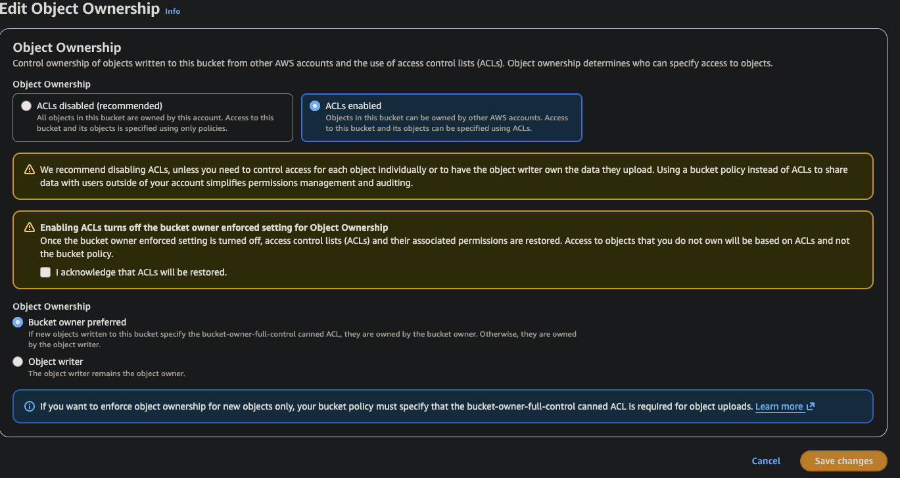

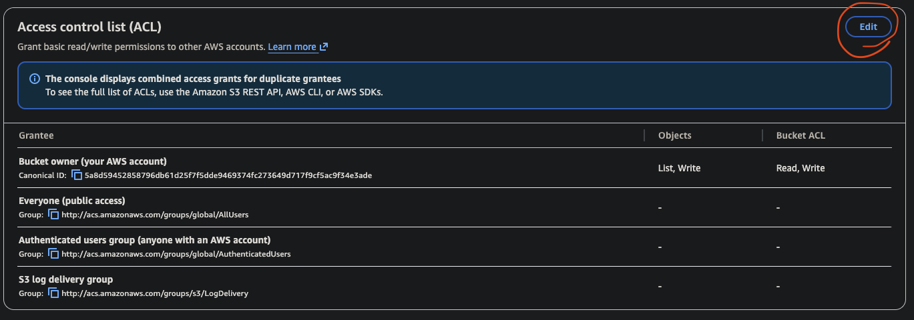
- want people to have access to bucket so we have to change the Grantee from this:
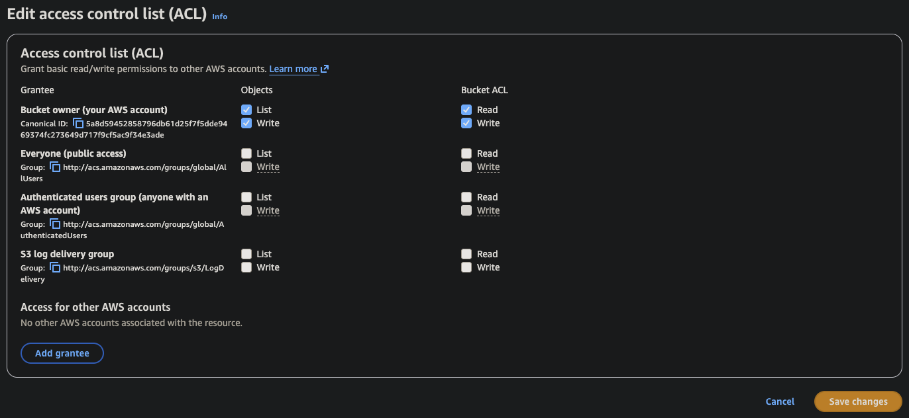
to this...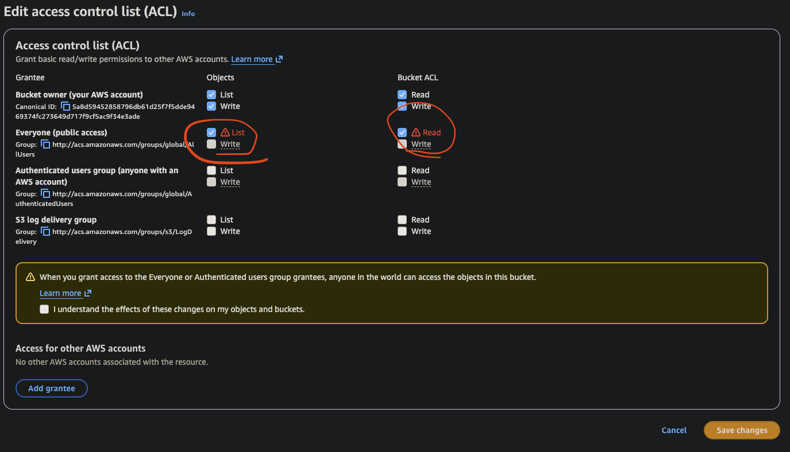
Last step...make the objects visible via ACLs

Recap
- Permissions tab = we allowed public access
- Object Ownership tab = enabled ACLs
- Edited ACLs, giving everyone access to BUCKET, not OBJECTS
- Choose objects, Actions, Make Public using ACL
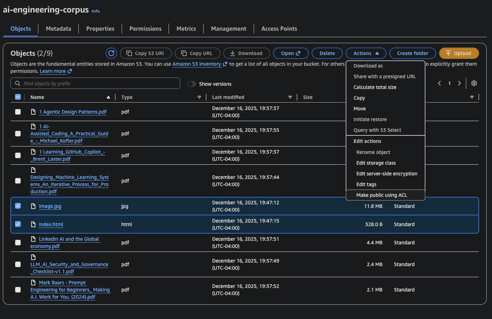
![[Screenshot 2025-12-16 at 8.22.23 PM.png]]

NOW, upon refresh...
http://ai-engineering-corpus.s3-website.us-east-2.amazonaws.com/

Now have a functioning S3 static webpage/site.

NOTE: if you want to change the picture, make sure to UPLOAD a NEW index.html file with a changed image source (i.e. img src=). It will overwrite if you have Versioning turned on.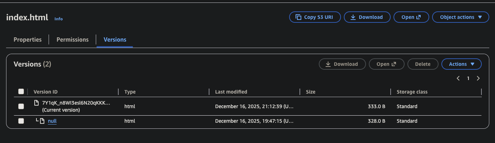
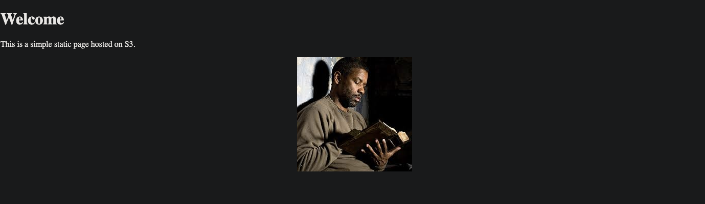