Continuation of Week 6

Open Terminal

Run Aarons code to make sure your computer is actually ready for this lab
- curl https://raw.githubusercontent.com/aaron-dm-mcdonald/Class7-notes/refs/heads/main/101825/check.sh | bash
- This script checks the following:
	- AWS CLI installed, configured and authenticated
	- Terraform binary is installed and up to date
	- TheoWAF folder present at `~/Documents/TheoWAF/class7/AWS/Terraform`
	- Creates a .gitignore file
	- only need to run it successfully once
It will create the TheoWAF folder structure if needed and will download a .gitignore file configured for Terraform projects.

Turn on AutoSave in Terraform
- under File

Goto Finder and make a folder with current date
- want to make sure that I can go to that same folder in Terminal

*pwd
- where am I?
*ls
- to see where next step 

All the way to your new folder 
- if it has a slash "/" after it, it's a folder

*touch 0-auth.tf
touch 1-vpc.tf
- stating this is a tf file

At this point, you've:
- made file structure, empty files
- navigated to file structure
- ready to build out tf files

Pull up Aarons notes 
https://github.com/aaron-dm-mcdonald/Class7-notes/tree/main/101825
- copy the 00-auth.tf = raw file
- paste INTO your 0-auth file in VSCode

*cp ../.gitignore .
- copy 
- up one directory
- target file
- current folder (.)

*ls -a 
- to see the .gitignore file, otherwise its hidden
- just ls won't work

Open Terminal in VSCode so you can do everything in one place
- *Code > Terminal > New Terminal
- it should open in your newly created folder

*pwd
ls
ls -a

Now, get Terraform started:
*terraform init
- consider they called it terraform "IPAD" but have since added a "V" for IVPAD
	- init
	- validate (optional)
	- plan
	- apply
	- destroy
- success IF it creates a terraform lock file (.terraform.lock.hcl)
- you only have to do the init command for THIS new folder on this new day, not continuously OR otherwise, for new modules and connections
	- Providers are basically plug-ins so you'll have to run to download it

Change region to us-west-2
- us-east-1 has had a lot of issues lately...that's where basically 40% of the internet went down the week of 14 Oct 2025.

- CTRL-S to save, if necessary

*terraform validate
- Success = "The configuration is valid."

*terraform plan
- Success = "No changes. Your infrastructure matches the configuration. Terraform has compared your real infrastructure against your configuration and found no differences, so no changes are needed.

*terraform apply
- Success = "No changes. Your infrastructure matches the configuration. Terraform has compared your real infrastructure against your configuration and found no differences, so no changes are needed. Apply complete! Resources: 0 added, 0 changed, 0 destroyed."
- terraform.tfstate file created

Go back to Aarons notes
- https://github.com/aaron-dm-mcdonald/Class7-notes/tree/main/101825
- copy raw code of his 01-main.tf file (this is his VPC)
- change the CIDR block a little if you like (to 10.107.0.0/16)
- tag Name = *titanlink-vpc

Now, we want to run through IvPAD with the new changes.
- *terraform validate
- *terraform plan
- *terraform apply

Sign into your AWS account to see if your VPC was actually created!
- make sure to check the right 

THIS GETS US TO WHAT WE DID IN WEEK 6

Network Planning Document
root VPC = 10.107.0.0/16

public sunet == can directly communicate with public internet
pub A = 10.107.1.0/24
pub B = 10.107.2.0/24
pub C = 10.107.3.0/24
pub D = 10.107.4.0/24

private subnet == can't directly communicate with public internet
priv A = 10.107.11.0/24
priv B = 10.107.12.0/24
priv C = 10.107.13.0/24
priv D = 10.107.14.0/24

Now, go to Theo's repository so we can use the code for some SUBNETS that he's done
- https://github.com/MentalAlchemist1/class5/blob/main/2-Subnets.tf

*touch 2-subnets.tf
- paste Theo's code into this new blank file

We have 2 resources from his code
- "aws_subnet" and "public-eu-west-1a"
- this is where we start working with KNOWN WORKING code and modifying the code for what we want it to do
- KNOW WHERE YOU WANT TO BUILD YOUR INFRASTRUCTURE
- already I know that I'm in a different region = us-west-2 = need to change!
	- copy and paste us-west-2 into ALL regions because I'm building all MY infra in THIS region, NOT eu-west-1 like Theo's code.
	- a, b, c is AZs
	- tag name will be the name in the AWS console online

vpc_id is a object.resource already built inside tf previously
- vpc_id = *app1.id
- go to 1-vpc file (here's where you're building the VPC)
- tf knows aws_vpc as "main" so you change it in YOUR vpc below...
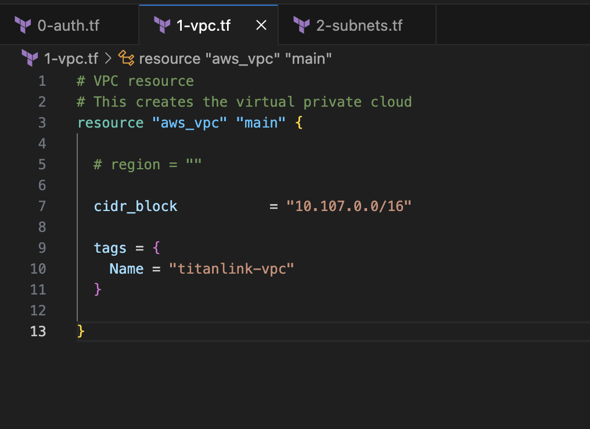

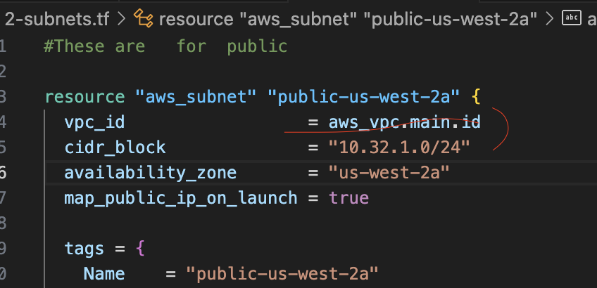
- changes to all blue because tf successfully found a VPC in my folder structure called main = good to go!

*terraform validate
terraform plan
- Note: You didn't use the -out option to save this plan, so Terraform can't guarantee to take exactly these actions if you run "terraform apply" now.
	- will discuss later

*terraform apply
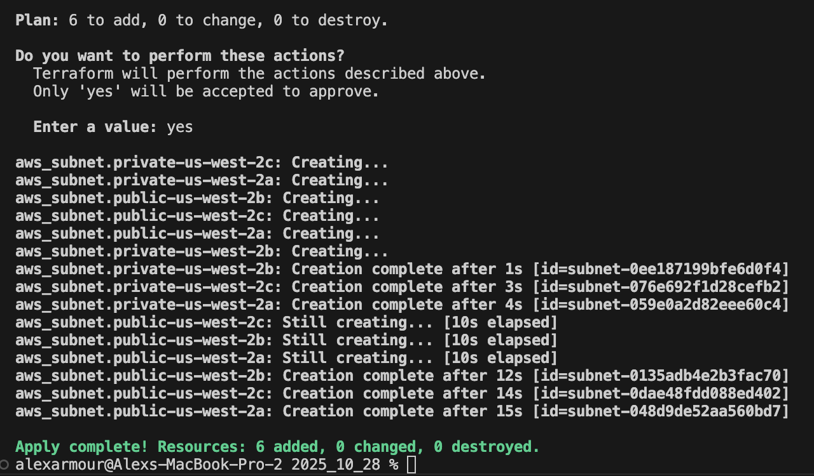

Now go to AWS and make sure the VPCs were created:
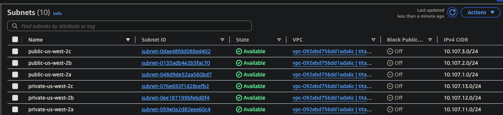

Check the Resource Map for your VPC to understand your BUILD so far:
- subnets
- single route table
- no network connections yet
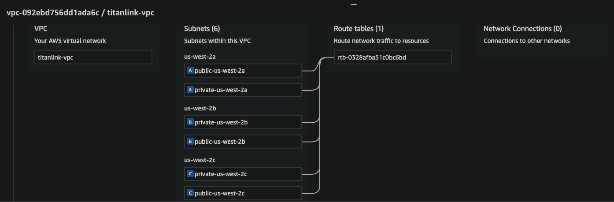

Let's build one more thing out for now - the Internet Gateway (IGW)

*touch 3-igw.tf

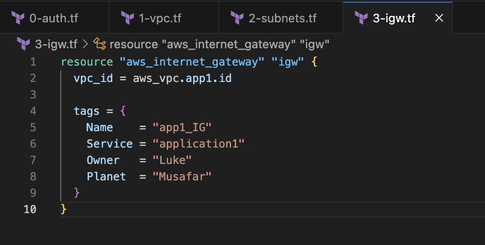
- FIRST set of quotations is WHAT YOU WANT TO BUILD in tf = "aws_internet_gateway"
- SECOND set of quotations is WHAT DO YOU WANT TO NAME so that tf has a reference for it
- **IMPORTANT: Make sure the reference is correct
	- The VPC created is called "main", not "AlexVPC" or something
	- SLOW DOWN and look at your entire codebase
		- **if ANYTHING is off or you mistype even ONE character, it won't run...the entire REGION goes down...now you don't have TikTok and Snapchat for a day!! It's that serious!

Subnet change = app1 to main
IGW change = app1 to main

Remember, the tags are for YOU, not AWS

Run it!
- *terraform validate
- *terraform plan
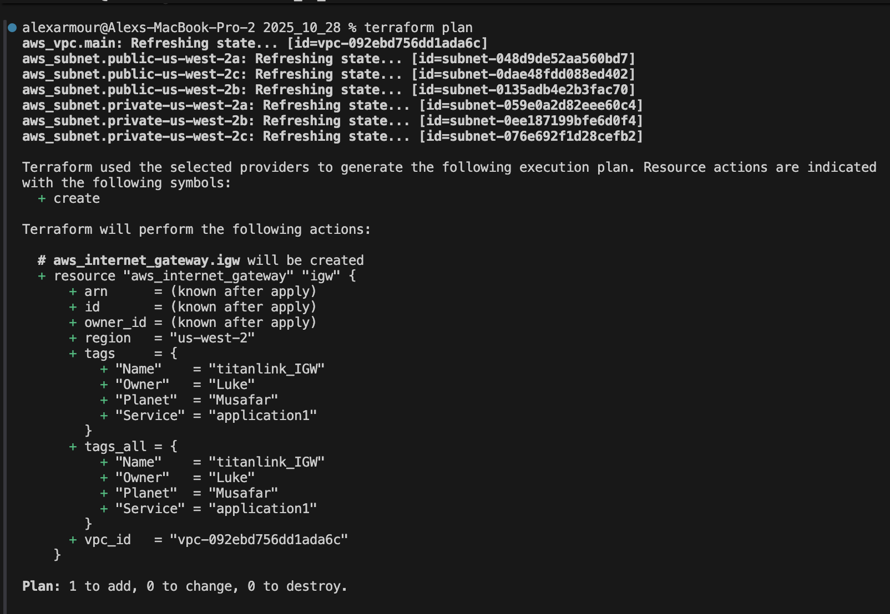
- *terraform apply

Go back to AWS to confirm if IGW is created...
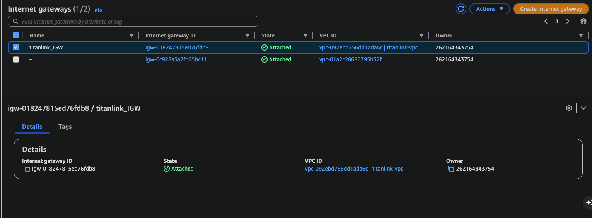

The infrastructure is BUILDING...congratulations!
- subnets
- route table
- IGW

Now, let's build a Network Address Translation (NAT) gateway:

Copy Theo's code for NAT:
https://github.com/MentalAlchemist1/class5/blob/main/4-NAT.tf

*touch 4-nat.tf

- delete vpc = true...was needed in Class5, not now.
	- only use with EC2 CLASSIC

You get charged for NAT gateways so be careful...just make 1.

"depends_on" is a way for you to explicitly tell tf to build something after something else is created.
- the NAT gateway depends on the creation of the IGW

Run it!
- *terraform validate
- *terraform plan
- *terraform apply

It's going from your computer into the AWS cloud to make everything.

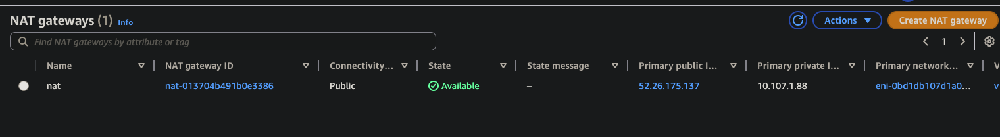

Now, have a NAT Gateway...
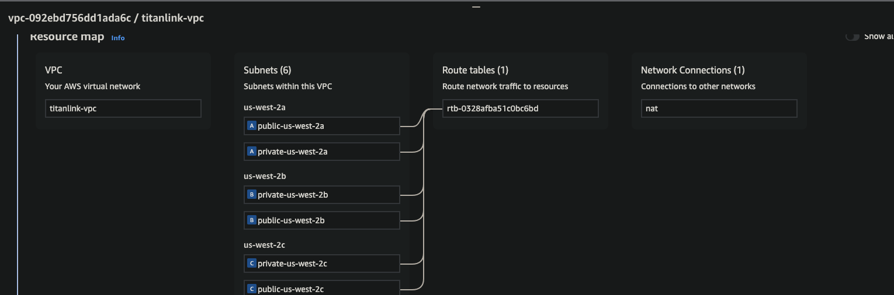
- need a more robust route table...
	- how our public subnets talk to the internet
	- how our private subnets talk to our public subnets

Theo's repo for Route Table...
https://github.com/MentalAlchemist1/class5/blob/main/5-Route.tf

*touch 5-route.tf

Update all route table associations
- attaches a rt that you created to a subnet
	- private
	- public

We get an error this time...
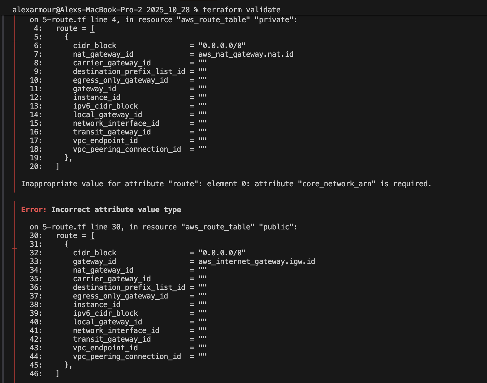
- this code doesn't really work anymore
- its saying its not getting an ARN from a route

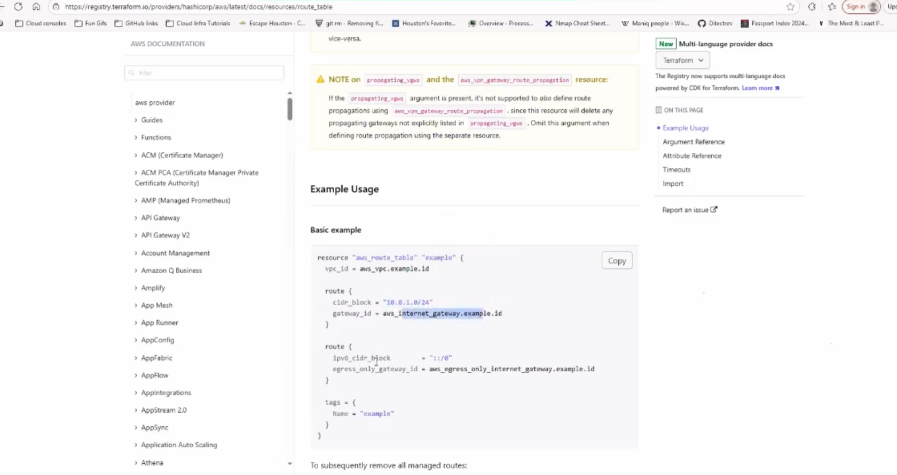

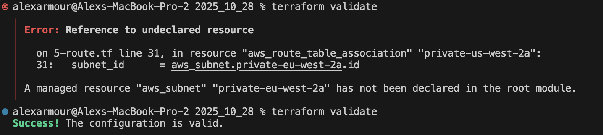
- fixed the subnet_id

Updated Theo Code: #theocode 

*terraform apply*

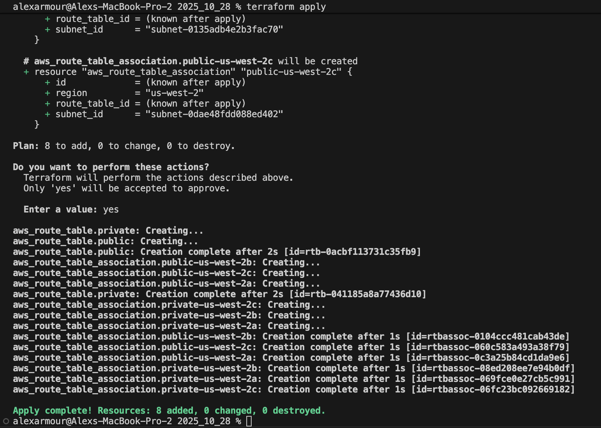

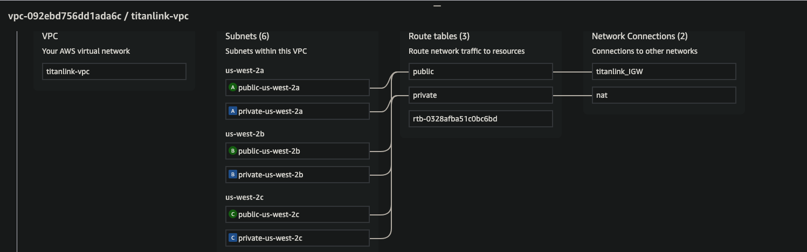
- subnets going to public to IGW
- private rt to NAT
- rt premade for VPC

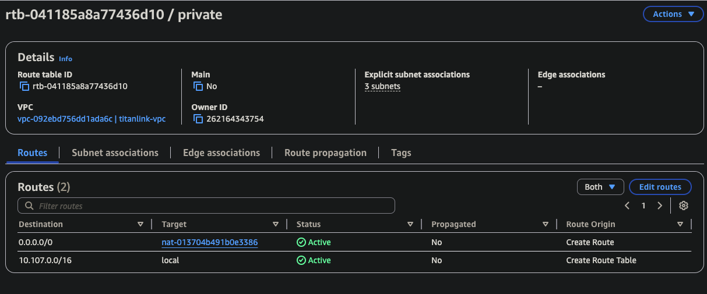
- private destination of 0s, targeting the NAT gateway
	- when you're in private subnet, you have to go through the NAT gateway to get to the internet.
	- local route is automatically made

*terraform state list
- reads the state file and tells you exactly what's there.
- see all currently managed resources within the folder that tf is running in
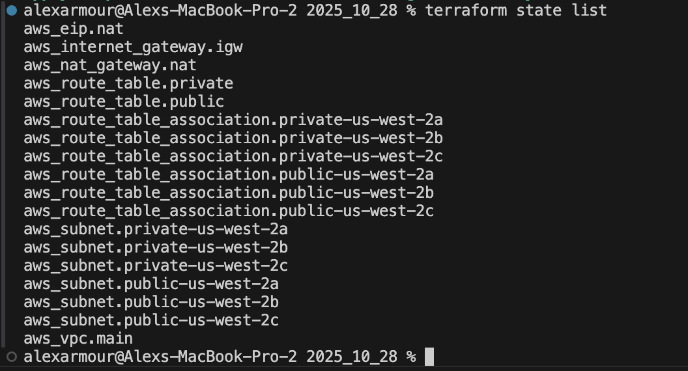

NOW, time to tear it all down...

*terraform destroy

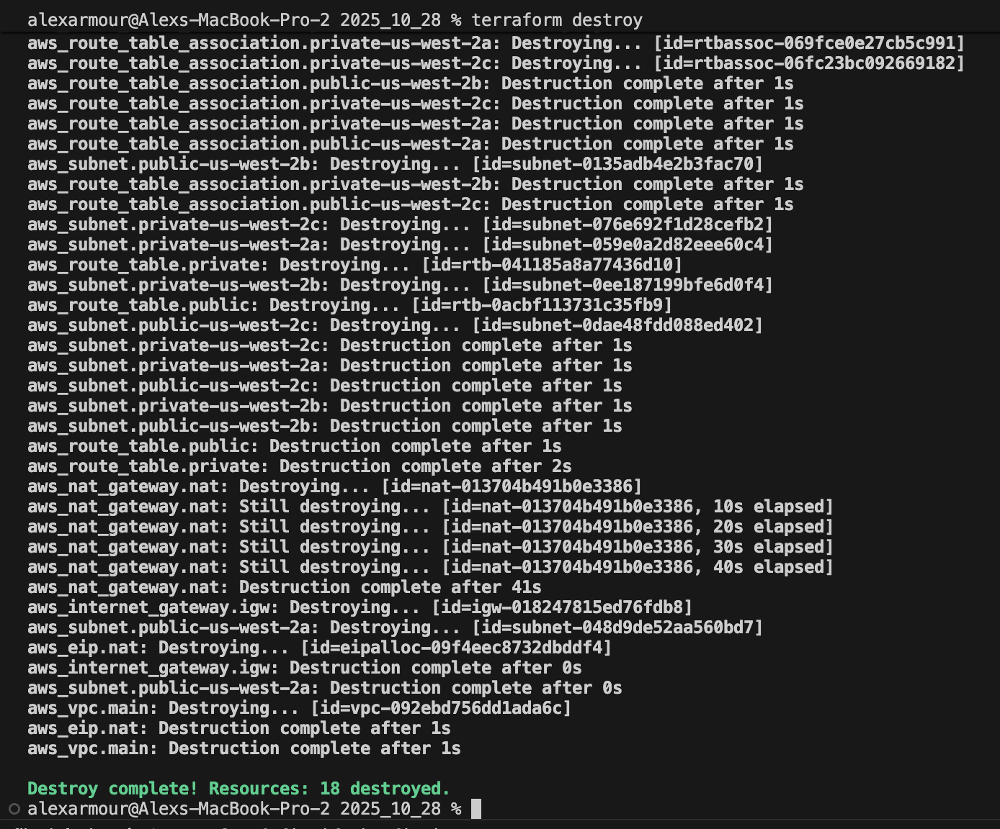
